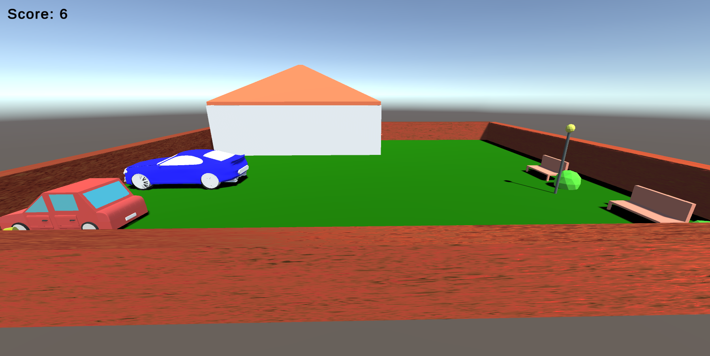

# CoinHunter – 3D Coin Collection Game

[](https://unity.com/) [](https://learn.microsoft.com/en-us/dotnet/csharp/) [](https://www.blender.org/)  
A fully custom-built 3D mini-game where the player collects coins in a modeled environment, developed from scratch using Unity, C#, and Blender.

---

## 🧠 About the Project

CoinHunter is an early experimental game development project aiming to explore 3D game design fundamentals.  
All game elements — including scripts, menu systems, player controls, objects, and animations — were built from scratch, while 3D assets were created in Blender.

The objective is simple yet engaging: **collect all the coins scattered around the environment** while navigating through obstacles and items.

---

## 🗂 Project Structure

```
📦 CoinHunter/
├ 📁 Blender_Models/                    # Original Blender 3D models
│  ├ 🧩 car.blend
│  ├ 🧩 house.blend
│  ├ 🧩 park.blend
├ 📁 CoinHunter_Data/                   # Unzipped game data folder (after extraction)
├ 📁 Images/                            # Gameplay screenshots
│  ├ 📸 Game1.png
│  ├ 📸 Game2.png
│  ├ 📸 Game3.png
│  ├ 📸 Menu.png
├ 📁 MonoBleedingEdge/                 # Unity runtime libraries (after extraction)
├ 💻 CoinHunter.exe                    # Executable game launcher
├ 📦 CoinHunter_Data.7z                # Zipped version of CoinHunter_Data (must unzip)
├ 💻 UnityCrashHandler64.exe           # Unity crash handler executable
├ 📦 UnityPlayer.7z                    # Zipped version of MonoBleedingEdge (must unzip)
├ 💻 UnityPlayer.dll                   # Unity engine runtime
└ 📄 README.md                         # You are here!
```

---

## ⚙️ How to Run

To play CoinHunter:

1. **Unzip** the two compressed folders:
   - `CoinHunter_Data.7z`
   - `UnityPlayer.7z`
   
   ➔ **Unzip them into the same main project folder** where `CoinHunter.exe` is located.  
   (After extraction, you should see the folders `CoinHunter_Data/` and `MonoBleedingEdge/` alongside the `.exe`.)

2. Launch the executable file:
   ```bash
   ./CoinHunter.exe
   ```

✅ No installation required.  
✅ No external dependencies needed.  
✅ Only UnityPlayer.dll and MonoBleedingEdge/ are required to run.

---

## 🎮 Game Overview

<p align="center">
  
  
</p>

<p align="center">
  
  
</p>

---

## 🎯 Gameplay Description

- **Objective**:  
  Collect all the coins scattered throughout the map to win the game.
  
- **Environment**:
  - Open outdoor area with fences, trees, benches, and a house.
  - Parked vehicles creating dynamic obstacles.
  
- **Player**:
  - Controls a black spherical avatar navigating freely through the environment.
  
- **Challenge**:
  - Navigate around obstacles carefully to collect all coins.
  - Plan an optimal route for maximum efficiency.

- **Menu Features**:
  - Start New Game
  - Options (placeholder for future settings)
  - Quit

---

## 🛠 Development Details

- **Engine**: Unity 3D
- **3D Modeling**: All environmental objects (house, cars, trees, coins, benches) were fully modeled in Blender.
- **Scripting**:  
  - Player movement handled through custom C# scripts.
  - Coin collection logic implemented via custom triggers and collision detection.
  - Menu system and game transitions programmed from scratch.
- **Animations**:  
  - Basic rigid body dynamics.
  - Interactive object collection.

---

## 🧪 Key Learning Outcomes

- 3D Game Design fundamentals: player controls, collision detection, environmental interaction.
- Blender modeling basics integrated into Unity.
- Scene organization, lighting, and material setup.
- Menu flow control and scene management in Unity.

---

## 📅 Year

2020

---

## 👨‍🎓 Author

- Andrea Perna 📧 and.perna99@gmail.com
- Mattia Zappalà 📧 matty.zapp.99.mz@gmail.com

---

## 📎 Resources

- 🎮 CoinHunter Executable Game
- 📷 Game Screenshots (`/Images/` folder)

---

## 📜 License

All rights reserved. Educational and personal portfolio use only.

---
